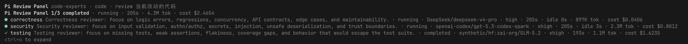
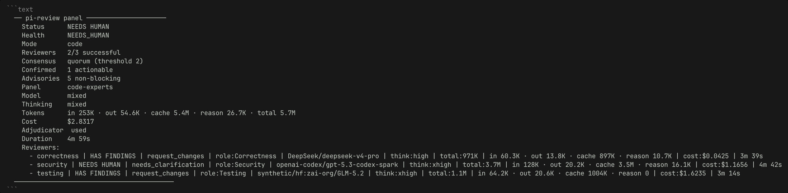
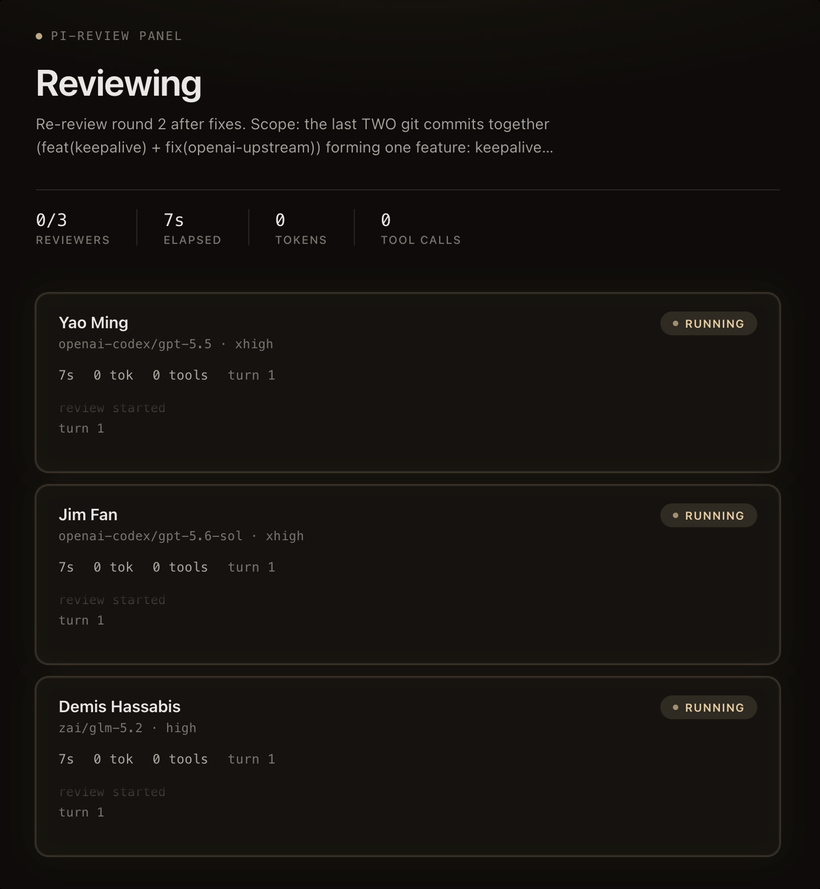

<div align="center">

# pi-review

**Isolated, multi-reviewer AI code review — as a CLI, a CI gate, and an agent skill.**

[](https://www.npmjs.com/package/@zephyrdeng/pi-review)
[](https://www.npmjs.com/package/@zephyrdeng/pi-review)
[](https://github.com/ZephyrDeng/pi-review/stargazers)
[](LICENSE)
[](https://nodejs.org)

[Quick start](#quick-start) · [Features](#why-pi-review) · [Panel review](docs/guide/panel-review.md) · [CLI reference](docs/guide/cli-reference.md) · [中文说明](README.zh-CN.md)

</div>

---

`pi-review` hands review work to a fresh, **read-only** [Pi](https://pi.dev) session and returns a structured verdict: findings with severity, evidence, location and a stable exit code. Run one reviewer, or a **panel of independent reviewers** that must agree before a finding blocks the gate. Your agent (Claude Code, Codex, Cursor, Pi) stays the only editor.

```bash
npm install -g @zephyrdeng/pi-review
pi-review -- @src/foo.ts                                      # one reviewer
pi-review --panel code-experts --consensus majority -- @src   # three lenses, one gate
```

<p align="center">
  
</p>

## Why pi-review

| | |
|---|---|
| **Isolated, read-only reviewers** | Every review is a fresh child process with a hard `read,grep,find,ls` allowlist. It cannot edit, commit, or leak context from your main session. |
| **Panel consensus, not one opinion** | 2–8 independent reviewers who never see each other. A finding blocks only when enough of them agree (`any` / `quorum` / `majority` / `unanimous`); singletons stay visible as advisories. |
| **Mix models per reviewer** | `--reviewer-model r1=openai/gpt-5.6:high --reviewer-model r2=anthropic/claude-opus-4.8:xhigh` — cross-family panels catch what one vendor misses. |
| **Machine-readable, host-agnostic** | One versioned `PI_REVIEW_META_JSON` line, exit codes `0/1/3/4`, and an `events-jsonl` stream. Drop into CI, hooks, or your own renderer. |
| **Loop gate for agent closeout** | `pi-review loop --until clean` re-reviews after each fix round, diffs findings across rounds, and stops on convergence — never unbounded. |
| **~1s screening** | `pi-review screen` skips LLM generation entirely: deterministic slicing + typed [Jev](https://typesafe.ai) judgments against a defect catalog. Measured **1.2s** vs 30–50s for a full round. |
| **Live everywhere** | Native live rows in Pi, a loopback **web dashboard** for Claude Code / Codex, streamed milestones on stderr for plain terminals. |
| **Three review modes** | `code` (correctness, security, tests), `plan` (six expert lenses), `challenge` (adversarial pressure test). Extend via JSON presets. |

## See it work

<table>
<tr>
<td width="50%"></td>
<td width="50%"></td>
</tr>
<tr>
<td align="center"><sub>Panel footer in any terminal — gate, consensus, cost, per-reviewer status</sub></td>
<td align="center"><sub><code>--ui web</code> dashboard for hosts that buffer stdout</sub></td>
</tr>
</table>

Every review ends with a structured report and a footer you can read at a glance:

```
── pi-review ────────────────────────────
  Verdict     ! REQUEST CHANGES
  Status      HAS FINDINGS
  Mode        code
  Findings    1 actionable / 1 total
  Model       provider/model
  Tokens      in 17.6K · out 512 · cache 2.0K · total 18.2K
  Cost        $0.05
  Duration    42.3s
──────────────────────────────────────────
```

Scripts read `PI_REVIEW_META_JSON:` from stderr — findings carry `severity`, `path`, `location`, `details`, `recommendation`. No Markdown scraping. → [Output & integration](docs/guide/output-and-integration.md)

## Quick start

**Prerequisite:** [Pi CLI](https://pi.dev) with at least one model provider configured.

```bash
# CLI
npm install -g @zephyrdeng/pi-review

# …or one shot: Pi package + skill for Claude Code / Codex / Cursor / Antigravity
npx @zephyrdeng/pi-review install
```

```bash
pi-review -- @src/foo.ts                                   # single review
pi-review --mode plan -- @docs/architecture.md             # multi-lens plan review
pi-review --reviewers 3 --consensus quorum -- @src         # panel
pi-review loop --until clean --max-rounds 5 -- @src        # bounded fix/re-review gate
pi-review screen src/order-service.ts                      # ~1s catalog screening
pi-review models                                           # what can I run on?
```

In Pi: `/rv @src`, `/rv-loop fix until clean @src`, `/rv-models`. In other agent hosts, install the skill once and ask for a review in plain language.

→ [Installation options](docs/guide/installation.md) · [Pi `/rv` commands](docs/guide/pi-package.md)

## How the panel decides

```
reviewers (isolated, read-only) ──► findings ──► deterministic match (path + summary)
                                                      │
                                       ambiguous pairs ┴─► Jev typed adjudication (~100 ms)
                                                             │  borderline 0.3–0.7 → one Pi re-judge
                                                             ▼
                                           consensus threshold ──► confirmed (blocks) / advisory
```

Reviewer failure → `blocked`; unparseable output → `needs_human`; never a silent pass. Adjudication cannot invent, drop, or rewrite findings — it only clusters. → [Panel review in depth](docs/guide/panel-review.md) · [Loop review](docs/guide/loop-review.md)

## Partners

<table>
<tr>
<td width="50%" valign="top">

### [OrcaRouter](https://www.orcarouter.ai/ref/ref_07ca74b3e41670e5ff36)

One key, every frontier model. `pi-review` ships a ready-made provider file — drop it into Pi and run cross-family panels without juggling vendor accounts.

[](https://www.orcarouter.ai/ref/ref_07ca74b3e41670e5ff36)

→ [Setup guide](docs/guide/providers.md)

</td>
<td width="50%" valign="top">

### [TypeSafe Jev](https://typesafe.ai)

A System One model that answers typed questions with probabilities in ~100 ms. Powers consensus adjudication, cross-round finding memory, scope `classify`, and the 1-second `screen` gate.

Set `TYPESAFE_API_KEY` and it switches on.

→ [Comparison report](docs/research/jev-comparison-report.html) · [Screening study](docs/research/jev-screening-case.md)

</td>
</tr>
</table>

## Documentation

| Guide | What's inside |
|---|---|
| [Installation](docs/guide/installation.md) | CLI, Pi package, agent skills (Claude Code / Codex / Cursor / agy), updates, from source |
| [CLI reference](docs/guide/cli-reference.md) | Every flag, review modes, when to use which command |
| [Panel review](docs/guide/panel-review.md) | Consensus policies, aggregation, Jev, `classify`, `screen`, live UI, web dashboard |
| [Loop review](docs/guide/loop-review.md) | Bounded rounds, `--until clean`, cross-round comparison, convergence stop |
| [Output & integration](docs/guide/output-and-integration.md) | Markdown shape, `PI_REVIEW_META_JSON` schema, exit codes, sessions, progress logs |
| [Configuration](docs/guide/configuration.md) | Config file, environment variables, security model |
| [Providers](docs/guide/providers.md) | OrcaRouter and other provider setup |
| [Research](docs/research/) | Jev architecture, screening measurements, adjudication case studies |

## Contributing

Issues and PRs welcome. Source is English-only; docs may be bilingual. Commits go through `ai-commit` via Husky (`npm install` sets up the hooks). See [installation → contributing](docs/guide/installation.md#contributing-language-policy).

## Star history

If `pi-review` caught a bug before your reviewer did, a ⭐ helps others find it.

[](https://star-history.com/#ZephyrDeng/pi-review&Date)

## Acknowledgments

System prompt structure inspired by [Codex-5.5-codex-instruct-5.5](https://github.com/yynxxxxx/Codex-5.5-codex-instruct-5.5) (MIT).

## License

[MIT](LICENSE) © ZephyrDeng
