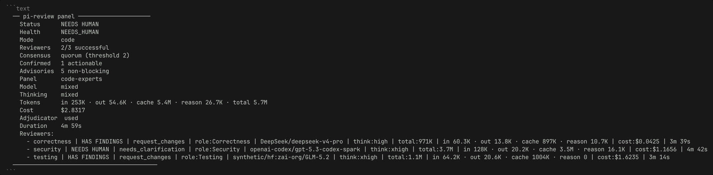
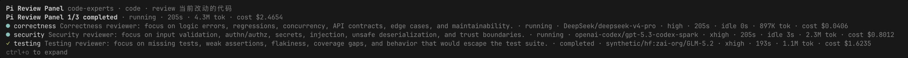
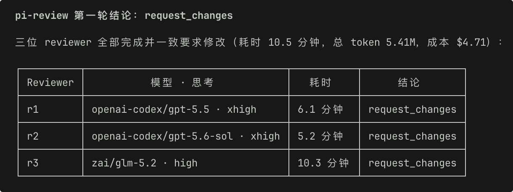
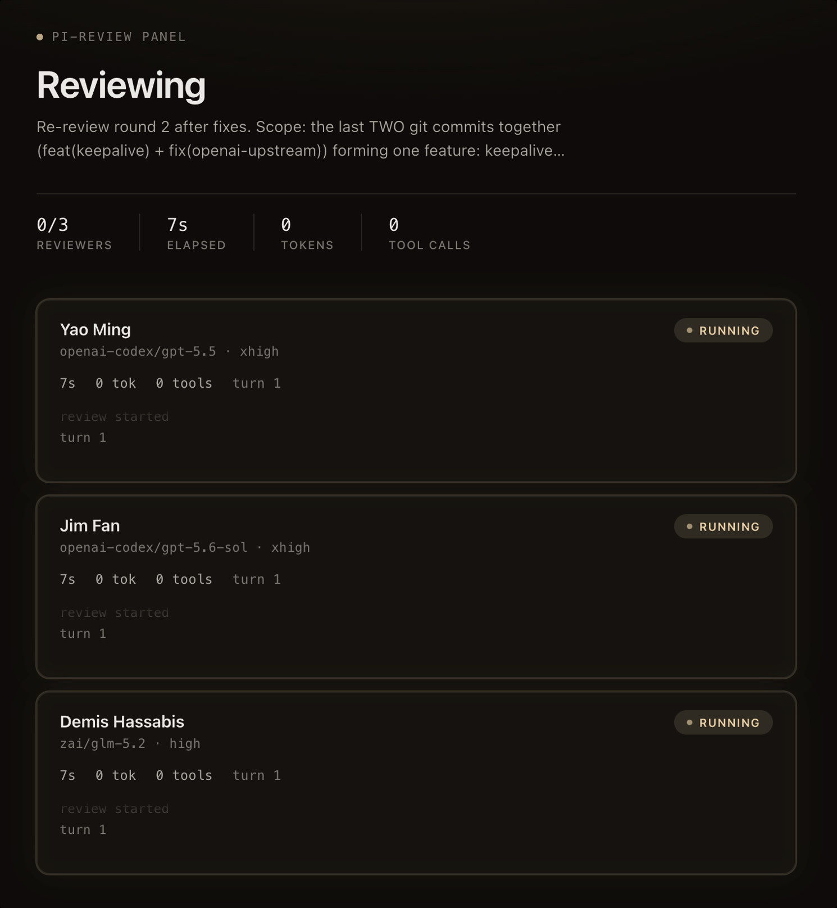

# pi-review

[English README](./README.md)

**在命令行中运行隔离的 AI 代码与方案审查。**

`pi-review` 把审查工作交给一次全新的、隔离的 [Pi](https://github.com/anthropics/pi) 子会话，并返回结构化结论。子会话只读、只评，不改文件、不打补丁、不提交。

可作为独立 CLI、Pi 包（扩展 + skill），或接入 CI / 编辑器工作流。

## 语言约定

| 范围 | 语言 |
|------|------|
| 源码（CLI、扩展、`review-presets.json`、提示词、代码里的用户可见文案） | **仅英文** |
| 文档（本页与英文 README） | **中英均可** |

实现与对外协议（如 `PI_REVIEW_META_JSON`、Verdict 枚举）保持英文，便于自动化与跨工具一致。

## 前置条件

- 已安装并配置好 [Pi CLI](https://pi.dev)，且至少有一个可用模型

## 安装

```bash
npm install -g @zephyrdeng/pi-review
# 一键：Pi 包 + Claude Code / Codex / Cursor 等 skill（推荐首次安装）
npx @zephyrdeng/pi-review install
# 仅 Pi 包
pi install npm:@zephyrdeng/pi-review
# 仅各 Agent skill
npx @zephyrdeng/pi-review install-skill
```

`install` 会在有 Pi CLI 时执行 `pi install npm:@zephyrdeng/pi-review`，再通过 [skills CLI](https://www.npmjs.com/package/skills) 非交互安装 agent skill。只用 Pi 时**不要**再跑 `install-skill`，避免与 `pi.skills` 重复冲突。可用 `--pi-only` / `--agents-only` 拆分。

升级全局包并同步 agent skill 内容：

```bash
pi-review update
```

即使包已是最新，也会刷新 skill（`skills update pi-review`；无 skills CLI 时回退到包内 skill 直拷）。

## 快速开始

```bash
pi-review -- @src/foo.ts
pi-review --model openai/gpt-5.5 -- @src/foo.ts
pi-review --mode plan -- @docs/architecture.md
pi-review --mode challenge -- @docs/design.md
pi-review loop --max-rounds 3 -- @src
pi-review models
```

## 审查模式

| 模式 | 说明 |
|------|------|
| `code`（默认） | 代码、diff、MR、文件与仓库审查 |
| `plan` | 多视角方案 / 架构审查 |
| `challenge` | 对抗式审查，压测假设与证据缺口 |

## Loop Review

`pi-review loop` 会对当前工作树执行有上限的、彼此隔离的只读审查轮次：

```bash
pi-review loop --max-rounds 3 -- @src
pi-review loop --until clean --max-rounds 10 -- @src
```

每轮都是完整 review run；命令不会编辑、打补丁、等待文件变化，也不会让子会话修复问题。遇到 `clean`、`needs_human`、`blocked` 会提前停止；仍有 actionable finding 时，在预算耗尽后以非零状态退出并输出逐轮摘要。宿主 Agent 或人工负责筛选并修复任务范围内的问题，再重新调用命令。需要在每次修复之间留出宿主处理点时，使用 `--max-rounds 1`。

`--until clean` 声明成功目标（clean gate），但仍有硬预算：省略 `--max-rounds` 时默认为 10，**不是无限循环**。Clean 定义：单审查无 actionable finding；面板审查无 confirmed actionable cluster；advisories 可保留；`needs_human`/`blocked` 绝不算 clean。

`loop` 复用普通审查的 mode/model/progress/target 参数；v1 明确不支持 `--keep-session`、`--continue`、`--name`。

每轮审查各自在 stderr 输出一条 `PI_REVIEW_META_JSON`，即[输出格式](#输出格式)里的富化 finding schema（`metaVersion`、每条 finding 的 `details`/`recommendation`/`location`、panel 轮次的 `sourceFindings`）；消费者按输出顺序逐轮读取该行即可拿到完整 finding 数据，无需刮取 Markdown，逐轮摘要（`LoopRoundSummary`）保持只含计数。

## Panel Review（面板审查）

面板审查让多个**独立**审查者在隔离子会话中并行评审，再聚合为同一个门禁结论。审查者看不到彼此的发现，因此一致代表独立发现。

```bash
# 单次面板审查
pi-review --reviewers 3 --consensus quorum --min-agree 2 -- @src
# 专家预设（正确性 / 安全 / 测试三视角）
pi-review --panel code-experts --consensus majority -- @src
# 面板 loop（最多 reviewer 数 × max-rounds 次审查 + 仲裁）
pi-review loop --reviewers 3 --consensus quorum --max-rounds 2 -- @src
```

### 共识（Consensus）

只有当足够多的独立审查者把同一问题标为 **actionable** 时，该 finding 才成为 **confirmed finding**（参与门禁）；否则保留为非阻塞的 **advisory**（建议）。多审查者面板默认 **quorum**，最低同意数 **2**，避免面板模式悄悄退化为"任一发现即 fail-closed"；单审查仍为阈值 1。

| 策略 | 阈值 |
|------|------|
| `any` | 1 个 actionable 审查者即确认 |
| `quorum`（默认） | 配置的最低同意数（默认 2，用 `--min-agree`） |
| `majority` | `floor(审查者数 / 2) + 1` |
| `unanimous` | 全体审查者 |

单条（未被交叉印证的）发现作为 **advisory** 可见，但不改变 clean 状态、不会让门禁失败。确认的可操作簇产生 `has_findings`；无确认簇则产生 `clean`。

### 聚合

两阶段匹配：先用稳定锚点（路径 + 归一化摘要）做确定性匹配；只有路径相同、措辞不同的模糊候选才交给受限的**语义仲裁器**（用 `--consensus-model` 启用）。仲裁器只能聚类，不得发明 finding、丢弃 finding、补充证据或充当额外审查者，且没有写工具。低置信匹配保持为独立 advisory，避免靠"相似"制造虚假共识。

### 成本与失败

审查者运行数 = `--reviewers <n>` × `--max-rounds`（loop）；启用 `--consensus-model` 时每轮最多再跑一次仲裁。用 `--concurrency <n>` 限制并发（默认等于审查者数，不超过）。审查者运行时失败 → `blocked`；无法解析的脏输出或未决澄清 → `needs_human`；绝不悄悄 clean。面板审查 v1 不支持 `--keep-session`、`--continue`、`--name`（审查者用 `--no-session`）；宿主 Agent 仍是唯一可编辑者。

面板结束后，CLI 会在 **stdout** 追加 panel ASCII footer：门禁 Status / Health、共识、确认与 advisory 计数、模型/thinking 不一致时的 `mixed`、聚合 token/cost、是否使用 adjudicator，以及每位 reviewer 一行摘要：



### 机器输出

一次面板评估只输出**一条**聚合 `PI_REVIEW_META_JSON`，新增字段：`strategy: "panel"`、`configuredReviewers`、`successfulReviewers`、`consensusPolicy`、`consensusThreshold`、`panelHealth`、`confirmedClusters`、`advisories` 以及每个 `reviewers` 的结果。顶层 `findings` 只含确认簇；advisory 单独存放。旧字段保留，老消费者可安全忽略新字段。面板级 `model` 取各审查者的有效模型（显式配置优先，否则取 provider 上报的 `responseModel`）：全员一致时为该值，不一致时为字面量 `"mixed"` —— 解析 `model` 字段的机器消费方需要识别这个哨兵值；每个 reviewer 条目仍各自携带 `model`/`responseModel`。

面板机器元数据另携带 `sourceFindings`：每位贡献 reviewer 的原始 finding，各自带全局唯一 `id`（如 `"r1#F1"`）与 `reviewerId`，可把 `confirmedClusters[].sourceFindingIds` / `advisories[].sourceFindingIds` 引用的每个 id 解析回完整富化 finding（含 `details`/`recommendation`/`location`，见[输出格式](#输出格式)）；簇级摘要保持现状，只含 `summary`/`severity`/`path`，不携带富化字段。

### Pi 实时进度与事件回放

Pi 中执行 `/rv @target` 会调用原生 **Pi Review Panel** 工具（API 标识仍为 `pi_review`，界面不再直接展示下划线名称）。每位 reviewer 都有独立实时行，明确展示 `queued/running/completed/failed/cancelled` 状态、当前工具、耗时和 token 用量；按 `Ctrl+O` 可展开查看有界活动记录、最终发现、溯源、总耗时、token 总量和 cost。



对应命令示例：`pi-review --panel code-experts -- @src`（Pi 内 `/rv` 走同一 panel 策略）。

一轮结束后，宿主侧常见汇总如下（多模型一致 `request_changes`、总耗时 / token / 成本）：



渲染器可直接消费版本化事件流：

```bash
pi-review --panel code-experts --output-format events-jsonl -- @src
```

该模式只向 stdout 输出 `ReviewEvent v1` JSONL。每次运行拥有一个 `runId` 和单调递增的 `seq`，活动文本会脱敏和截断，结尾固定为一条携带 `PanelReviewMeta` 的 `panel.completed` 事件。`createPanelViewState()` 与 `reducePanelEvent()` 支持确定性的实时归约和回放。

Panel reviewer 固定使用 `read,grep,find,ls` 白名单；shell 与可变更工具会在启动前被拒绝。`Ctrl+C` 会取消 reviewer 与 adjudicator 进程树，输出取消事件并生成一条 blocked 最终事件。

### 本地网页看板

`--ui web` 启动一个可选的、仅回环访问的看板，供没有原生 Pi 渲染器的宿主（Claude Code、Codex、纯终端）使用：

```bash
pi-review --reviewers 3 --consensus quorum --ui web -- @src
```



CLI 会在 reviewer 启动前把 `PI_REVIEW_UI_URL: http://127.0.0.1:<port>/run/<token>` 打印到 stderr，并自动在默认浏览器中打开该地址（`--no-ui-open` 可关闭自动打开）。看板实时展示每位 reviewer 的状态、流式活动、带滚动动效的 token/工具调用计数；运行结束后展示门禁结果、确认发现/advisory，以及每位 reviewer 由 markdown 渲染的完整报告。`--ui-url-file <path>` 会额外把该 URL 原子化写入文件，供会缓冲 stdout/stderr 的宿主使用。审查进程本身仍在运行结束后立即以原有 panel 退出码退出。

运行完成后页面显示 60 秒倒计时，倒计时结束自动关闭页面并停止看板服务；任何交互（滚动、点击、按键或 "Keep open" 按钮）都会取消倒计时，此后关闭标签页同样会停止服务。作为兜底，服务会在有界空闲 TTL（默认 900 秒，可用 `--ui-ttl <秒数>` 覆盖）后自行退出，以便浏览器刷新后重连。

看板仅绑定 `127.0.0.1`/`::1`，每次运行都用高熵能力令牌保护，发送不含远程资源或 CORS 的严格 CSP，所有 reviewer/发现文本均通过安全 DOM 写入渲染（markdown 由内置渲染器解析；链接仅允许 http/https，全程不经过 innerHTML）。看板仅用于查看：取消操作仍由发起的终端/agent 宿主负责（`Ctrl+C`）。`--ui web` 必须配合活跃的 panel 使用，且不能与 `loop` 组合。

## Pi 包：`/rv` 命令

安装 Pi 包后可在 Pi 里使用 `/rv`：

```
/rv-models
/rv @src
/rv review the auth changes
/rv-loop fix until clean @src
/rv --mode challenge @docs/design.md
/rv --continue <handle> --mode challenge --model provider/model "expand finding 2"
```

跟进审查时，`--continue` 与首次 `/rv` 一样可**选填** `--mode`、`--model`（以及后续 CLI 支持的其它选项由 skill 直接调用 CLI 时传入）。

斜杠命令只选策略：`/rv` panel、`/rv-loop` loop closeout、`/rv-models` 模型目录；后面一律是自然语言 target。模式/模型/panel/路径处理等其余策略匹配放在 skill 与 CLI。普通 `/rv @src`、`/rv review the auth changes`、`/rv-loop fix until clean @src` 无需额外参数；`--continue`、`--keep-session`、loop 与显式 `--no-stream` 走 shell CLI 路径。

**Claude Code / Codex 等 Agent 宿主**：`pi-review` 默认把可读文本增量流到 stdout，把**语义化里程碑**写到 stderr（`pi-review: review started` / `pi-review: tool <name> started/finished` / `pi-review: review finished`）；token 用量默认就能拿到，无需 `--progress-log`。`--progress-log` 退化为可选的调试用全量事件日志。详见 `skills/pi-review/SKILL.md`、`skills/pi-review/references/codex-tools.md` 与英文 README。

## 输出格式

审查结果包含 `## Verdict`、`## Summary`、`## Findings` 等章节。每条 finding 使用 `F1 + Severity + Path + Lines + Side + Actionable + Evidence + Impact + Recommendation` 结构；`Lines`/`Side` 可选，只在有可靠行号时给出（单行 `42` 或闭区间 `42-58`），`Side` 标注行号属于 diff 的哪一侧（`base` 改动前 / `working` 改动后，省略即 `working`）。ASCII 页脚会显示 Verdict、`Status`、finding 数量、Mode、总 token、cost、Duration/Session；Pi 面板展开结果也会包含同一组运行指标。

机器可读 JSON 仍在 **stderr** 的单行 `PI_REVIEW_META_JSON:` 中，并以新增字段提供：

- `metaVersion`: schema 版本判别字段（当前为 `1`）；更早版本的输出没有此键，缺失即视为富化前的原始契约
- `status`: `clean | has_findings | needs_human | blocked`
- `findings`: `{ id?, severity?, path?, summary, actionable, details?, recommendation?, location? }[]` — `details` 把 reviewer 的 Evidence/Impact 以 `Evidence: ...`、`Impact: ...` 段落（空行分隔）原样保留，只有其一时仅含该段；`recommendation` 单独保留修复建议；`location` 为 `{ startLine, endLine?, side? }`，仅在行号可解析时出现，畸形值（非数字、零/负数、倒置区间）一律省略而非编造，`side` 缺省即 `working`
- `actionableCount`: 可操作问题数量
- `usage.totalTokens`: token 总量；`usage.costTotal`: provider 报告的 cost（若有）

该机器 finding schema（连同 panel 的 `sourceFindings` 与 loop 每轮的 meta 行）是**受支持的集成面**：渲染器直接读 `PI_REVIEW_META_JSON` 即可，无需刮取审查 Markdown；完整字段表见英文 README 的 "Machine finding schema" 一节。旧字段不删除；需改为写入 stdout 时设 `PI_REVIEW_META_STDOUT=1`。解析器优先识别上述 `### F1` 格式，也兼容旧的三级标题和顶层列表；缺少 `Actionable` 时，`request_changes` 下默认可操作，其它 verdict 默认不可操作。无法识别 verdict 时会回退到 `needs_human` 并附带 `parseError`，运行时失败始终保持 `blocked`。

退出码：`0` clean、`1` 最终状态为 `has_findings` / loop 预算耗尽、`2` 参数错误、`3` needs human、`4` blocked / 运行时失败。

## 配置

提交代码：`npm install` 后会启用 **Husky** 钩子（`.husky/` → `ai-commit` 的 prepare-commit-msg / commit-msg / pre-commit）。也可 `git add` 后直接 `ai-commit commit`。配置见 `.ai-commit.yaml`（英文、`ai_footer: off`，需本机安装 ai-commit ≥ v0.1.45）。

可通过 `PI_REVIEW_HOME`、`PI_REVIEW_PRESETS`、`PI_REVIEW_SYSTEM_PROMPT` 等环境变量覆盖预设与系统提示词路径。预设与审查指令文件内容均为英文。

## 安全

- 每次审查在隔离子进程中运行
- 默认不保留子会话；`--keep-session` 仅用于显式跟进
- 审查会话只读，不编辑、不部署

## 许可

[MIT](LICENSE) © ZephyrDeng
