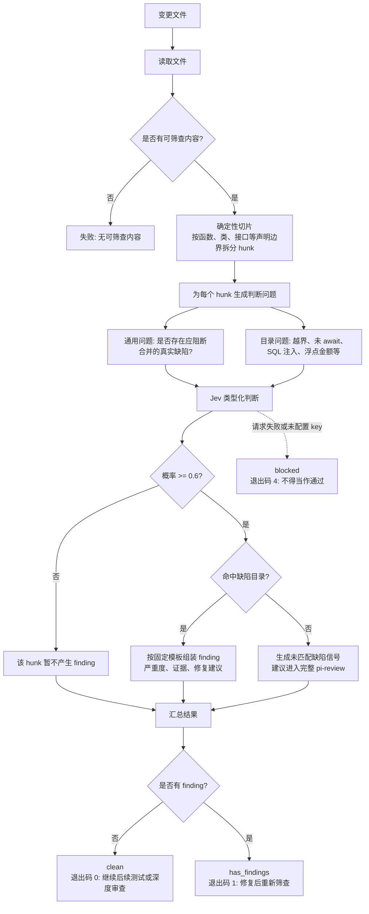

# `pi-review screen` 筛查流程

`screen` 是提交、推送和 CI 中的第一道快速门禁：先用约 1 秒拦截常见高风险缺陷，再决定是否进入完整审查。它不是 `review`、`panel` 或 `loop` 的替代品。

```bash
pi-review screen src/order-service.ts
```

## 流程图



## 四个阶段

1. **确定性切片**：本地读取文件，按声明边界拆成带有稳定路径和行号的 hunk。
2. **Jev 判断**：每个 hunk 同时接受一个兜底问题和多个目录模式问题；不启动 Pi 子会话，也不生成 Markdown 长文。
3. **模板组装**：概率达到 `0.6` 时命中。已知模式使用固定模板；未知但被兜底问题命中的风险会生成“未匹配缺陷信号”，不会静默放行。
4. **门禁返回**：标准输出给人看，stderr 输出 `PI_REVIEW_SCREEN_JSON` 供脚本读取。

内置目录覆盖注入类（SQL、命令注入、XSS、路径穿越、硬编码密钥、弱随机数、ReDoS）、经典正确性缺陷（差一错误、`||` 默认值吞 falsy、字典序排序、可变默认参数、忽略错误、裸 catch、浮点金额/比较、缓存别名、缺少校验）、数据丢失（未 await、资源未关闭）与循环内串行 `await`。模式提炼自社区规则集（Semgrep registry、ESLint/typescript-eslint、SonarSource、CWE Top 25），均为 hunk 内可判的是/否题；跨 hunk 污点分析仍交给完整审查。

## Screen memory —— 目录随使用生长

pi-review 状态目录（`config.json` 同级，默认 `~/.pi/pi-review/`）下有两个文件：

- **`screen-patterns.json`** —— 自定义目录层。条目合并在内置目录之上；id 与内置相同则覆盖，`disabled` 列表可停用在当前代码库误报的模式：

  ```json
  {
    "patterns": {
      "pii_console_log": {
        "title": "console.log prints a sensitive or PII-bearing payload",
        "severity": "major",
        "category": "security",
        "recommendation": "Drop the log or redact fields before printing."
      }
    },
    "disabled": ["missing_validation"]
  }
  ```

  `PI_REVIEW_SCREEN_PATTERNS=<path>` 在机器文件之后再加载一个文件并在 id 冲突时胜出 —— 指向仓库内提交的目录文件即可与团队共享模式。改动下次运行即生效；非法条目在 stderr 告警并跳过。
- **`screen-memory.jsonl`** —— 每个被标记的 hunk 追加一条记录（代码哈希、判定结果、命中模式）。按内容哈希去重、上限 500 条。`PI_REVIEW_SCREEN_MEMORY=0` 关闭记录；`PI_REVIEW_SCREEN_MEMORY_FILE` 改存放位置。

`pi-review screen-memory` 聚合这份日志：每个模式的命中频次（判断哪些条目值得保留）和按 hunk 分组的**未匹配信号**（兜底命中但目录未命中）—— 后者就是新模式的晋升候选。晋升永远由人或 agent 编辑 `screen-patterns.json` 完成，screen 不会自改目录。

## 结果怎么处理

| 结果 | 含义 | 下一步 |
|---|---|---|
| `clean` / `0` | 没有筛出的阻断问题 | 继续测试、构建或完整审查 |
| `has_findings` / `1` | 发现阻断问题 | 修复后重新运行；未匹配信号应进入完整审查 |
| `blocked` / `4` | 筛查无法可靠运行 | 配置 `TYPESAFE_API_KEY` 或改用完整审查，不能当作通过 |

推荐流水线：

```text
变更文件
   │
   ▼
pi-review screen
   │
   ├─ 有问题 ──► 修复 ──► 重新 screen
   │
   └─ clean ──► 测试 / 构建 ──► review 或 panel 深度审查
```

相关内容：[英文筛查指南](../screening.md) · [面板审查](panel-review.md) · [筛查研究](../../research/jev-screening-case.md)
